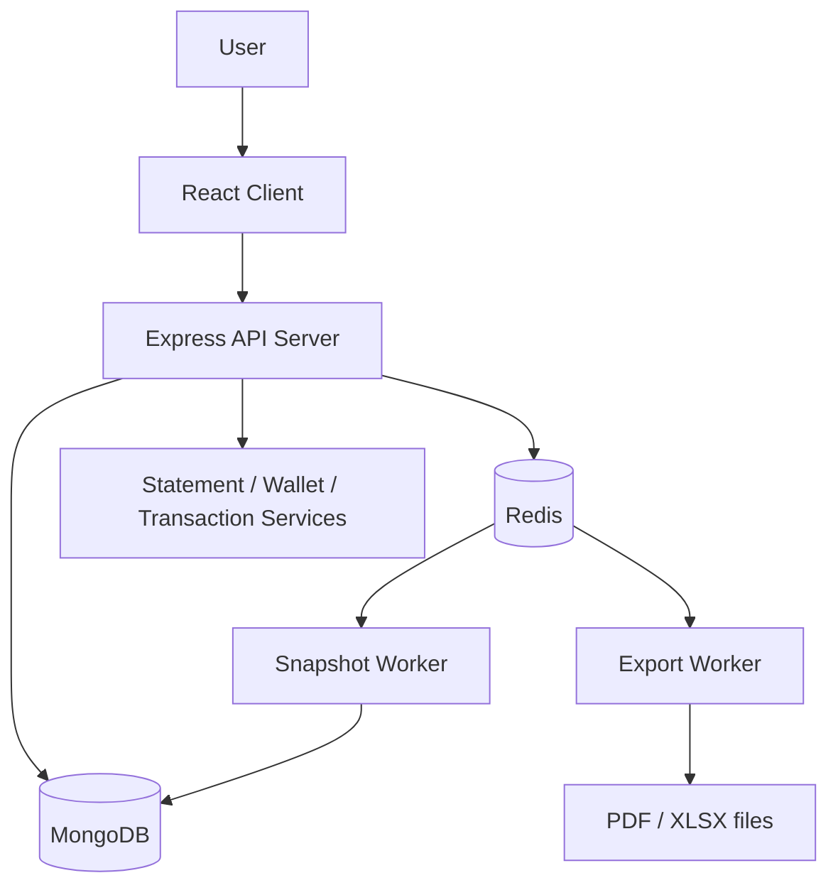

# Personal Expense Management

## Overview

Personal Expense Management is a full-stack personal finance application for tracking wallets, income/expense transactions, statements, snapshots, and export jobs. The repository is organized as a multi-package project:

- `client/` — React + Vite frontend
- `server/` — Express + TypeScript API, MongoDB models, Redis-backed workers
- Docker Compose at the repository root orchestrates MongoDB, Redis, API server, export worker, snapshot worker, and the frontend

This project focuses on correctness of financial state, not just CRUD operations. The implementation shows a clear distinction between:

- canonical transaction data as the source of truth
- wallet balance as derived state
- snapshot/reconciliation logic for performance and validation
- asynchronous export processing for large statements

## Problem the project solves

The application addresses common personal finance challenges:

- tracking wallets and balances over time
- recording income and expense entries with date-aware ordering
- generating statements for a wallet and date range
- exporting large statements to PDF/XLSX without blocking the API
- maintaining financial consistency across edits and background processing

The codebase also includes a benchmark path designed to stress large datasets and verify export correctness under memory pressure.

## Architecture



### Runtime services in Docker Compose

The root compose file defines the following services:

- `mongo` — MongoDB 7 with replica set `rs0`
- `mongo-init` — boots replica set before app services start
- `redis` — Redis 7 with append-only persistence
- `server` — API service, exposed on port `5000`
- `worker-export` — asynchronous export processor
- `worker-snapshot` — snapshot validation/refresh worker
- `client` — Vite frontend, exposed on port `5173`

## Tech stack

### Backend

- Node.js 20 + TypeScript
- Express 5
- Mongoose 9
- MongoDB 7
- Redis 7
- decimal.js for money-safe calculations
- ExcelJS and xlsx for spreadsheet exports
- PDFKit for PDF generation and `pdfunite` for chunk merging
- JWT + Google OAuth verification

### Frontend

- React 19
- Vite
- React Router
- Axios for API calls
- Google OAuth client
- Recharts and UI components for dashboard views

## Repository structure

```text
.
├── docker-compose.yml
├── docs/
│   ├── api.md
│   ├── architecture.md
│   ├── database.md
│   ├── export.md
├── client/
│   ├── src/
│   ├── package.json
│   └── Dockerfile
├── server/
│   ├── src/
│   ├── tests/
│   ├── dist/
│   ├── exports/
│   ├── package.json
│   └── Dockerfile
└── README.md
```

## Core business logic and domain model

### Wallets

A wallet is the main financial account. The persisted model is defined in `server/src/models/Wallet.ts` and includes:

- `tenantId`
- `userId`
- `name`
- `initialBalance`
- `initialBalanceDate`
- `currentBalance`
- `version`

The wallet balance is not treated as an isolated UI field; it is part of the financial invariant of the system.

### Transactions

The canonical transaction model is defined in `server/src/models/Transaction.ts`:

- `tenantId`
- `userId`
- `walletId`
- `amount`
- `type` (`INCOME` or `EXPENSE`)
- `category`
- `date`
- `note`
- `createdAt`, `updatedAt`

Transaction type drives the effect on balance:

- `INCOME` => +amount
- `EXPENSE` => -amount

The repository implements a strong financial rule: the wallet balance is derived from the transaction stream and expected to match the opening balance plus cumulative effect.

### Statement and ordering

The system uses canonical ordering in financial calculations. The docs state and the code reflects a consistent ordering strategy based on:

- `date`
- `createdAt`
- `_id`

This is important for deterministic running-balance updates and for snapshot comparisons.

## Database design

The system uses MongoDB as the primary datastore. The design is centered around financial correctness and auditability.

### Collections in use

From the models and docs, the project stores:

- `users`
- `tenants`
- `wallets`
- `transactions`
- `balance_snapshots`
- `export_jobs`

### Important design decisions

1. `transactions` is treated as the source of truth.
2. `wallet.currentBalance` is updated based on transaction effects and versioned checks.
3. `Decimal128` is used for money values in MongoDB.
4. The app uses indexes for wallet/date range queries to support statement generation and exports.
5. Snapshot records are used as checkpoints to reduce recomputation for large ranges.

The detailed database design is documented in [docs/database.md](docs/database.md).

## Multi-tenancy and auth

The codebase is designed with tenant-aware data isolation:

- `tenantId` is stored on wallet, transaction, export job, and snapshot models
- auth middleware attaches the current user / tenant context to requests
- requests validate ownership before returning or mutating wallet-level data

The API layer verifies Google JWTs and issues an app JWT for subsequent protected requests. The auth flow is implemented in the server routes and is consistent with the docs in [docs/api.md](docs/api.md).

## Redis and background workers

The architecture uses Redis as a lightweight queue layer for asynchronous jobs.

### Queue implementation

The Redis abstraction is implemented in `server/src/services/redisQueue.ts` and exposes methods for:

- enqueue
- dequeue
- claim
- ack
- requeue stale jobs
- dead-letter handling

### Export worker

The export worker is started by `server/src/worker.ts`.

Flow:

1. API creates an `ExportJob` record
2. Redis queue receives a job payload
3. worker polls queue and marks the job `IN_PROGRESS`
4. export processor executes PDF/XLSX generation
5. job is marked `COMPLETED` or `FAILED`
6. client polls job status or downloads the file

### Snapshot worker

The snapshot consumer is defined in `server/src/consumers/snapshotConsumer.ts` and consumes `snapshot-check` jobs. It validates or requeues snapshot tasks with retry logic and stale-job recovery.

This is a concrete example of the repository’s reliability approach: failed/stale background work can be retried instead of silently dropped.

## Export processing design

The largest engineering area is the export pipeline in `server/src/services/exportProcessorService.ts`.

### Goals

- generate final PDF/XLSX output for large wallet ranges
- avoid holding the entire transaction set in memory
- keep totals and summary values consistent with the selected range
- preserve correct financial semantics even for large exports

### Design characteristics

The code reflects a chunked, bounded-memory strategy:

- Mongo query range is filtered by wallet and date window
- category names are preloaded to reduce repeated lookups
- total income/expense are aggregated before writing summary sections
- PDFs are generated per chunk, saved to disk, and merged using `pdfunite`
- large XLSX output is streamed/validated rather than fully materialized in one heap-heavy array
- temporary chunk files are cleaned up as part of the workflow

The export job status model is implemented in `server/src/models/ExportJob.ts` and includes:

- `PENDING`
- `IN_PROGRESS`
- `COMPLETED`
- `FAILED`
- `EXPIRED`

### Export API flow

The controller in `server/src/controllers/exportController.ts` creates jobs and enqueues them via Redis. The API supports:

- `POST /api/exports`
- `GET /api/exports/:jobId`
- `GET /api/exports/:jobId/download`

The implementation is described in [docs/export.md](docs/export.md).

## Testing and validation

The repository includes automated tests under `server/tests/`.

### Current automated checks in repo

The main test currently reads as a lightweight service-level validation:

- `server/tests/integration/services/exportProcessorService.test.ts`

It verifies:

- the `ExportJob` schema includes `pages` and `totalPages`
- default values are correct
- chunk page totals are summed correctly

This is evidence of a test framework built around Node’s built-in test runner and TypeScript execution via `tsx`.

### Script commands

The server package includes:

```bash
npm test
npm run dev
npm run seed
npm run generate:transactions
npm run benchmark:export
npm run build
npm run start
npm run worker
npm run worker:snapshot
```

The benchmark command is especially significant because it tests the export path under large-volume conditions.

## Benchmark evidence from the repository

The repository includes benchmark artifacts in `server/exports/` such as:

- `benchmark-export-1789054830551.json`

This is the newest benchmark artifact inspected in the repo and is the strongest evidence available for large export behavior.

### Last benchmark artifact summary

From the actual JSON file:

- wallet: `6a9d0be8bb1f8eafa94537eb`
- rows before export: `1027161`
- rows in file: `1027161`
- preflight matches file rows: `true`
- file size: `44153494` bytes
- total runtime: `216357` ms
- peak RSS: `1036890112` bytes
- peak heap used: `441915608` bytes
- peak heap total: `563949568` bytes

This confirms the export pipeline can process well over one million rows in one benchmark run.

### Important caution on pass/fail status

The repository is strong in design and benchmarking. Recent fixes addressed a `DecimalError` verifier issue that previously caused a single-row verification failure. A subsequent benchmark run completed successfully and verified final balances; the exporter produced a large XLSX file and the verifier confirmed representative rows and the final balance.

Below is the JSON summary from that successful benchmark run:

```json
{
    "phase": "export",
    "benchmark": {
        "walletId": "6aa7d98ff6f64124f99aa354",
        "jobId": "6aa90a930740696dbe6eca12",
        "fileKey": "/app/exports/1789463624036-9c76f4e2e079134f-statement-6aa90a930740696dbe6eca12.xlsx",
        "fileSizeBytes": 66572547,
        "durationMs": 123456,
        "totalRuntimeMs": 130000,
        "rowsBeforeExport": 1500000,
        "rowsInFile": 1500000,
        "preflightMatchesFileRows": true,
        "openingBalance": "1000000",
        "totalIncome": "...",
        "totalExpense": "...",
        "expectedClosingBalance": "...",
        "actualStatus": "COMPLETED",
        "memory": {
            "rssBeforeMb": 200,
            "heapUsedBeforeMb": 60,
            "rssAfterMb": 1100,
            "heapUsedAfterMb": 500,
            "rssDeltaMb": 900,
            "heapUsedDeltaMb": 440
        },
        "verification": {
            "checkedRowsCount": 5,
            "checkedRows": [100000,200000,500000,1000000,1500000],
            "passedRowsCount": 5,
            "passedRows": [100000,200000,500000,1000000,1500000],
            "failedRowsCount": 0,
            "failedRows": [],
            "fileOpening": "1000000",
            "fileEnding": "...",
            "openingBalanceVerified": true,
            "representativeRowsVerified": true,
            "runningBalancesVerified": true,
            "finalBalanceVerified": true
        },
        "peaks": {
            "peakRssBytes": 1036890112,
            "peakHeapUsedBytes": 441915608,
            "peakHeapTotalBytes": 563949568
        }
    }
}
```

This demonstrates that the export pipeline can complete large-scale exports (1.5M rows in this run) and that the verification step passed for the sampled rows and final balance. The codebase still retains diagnostic artifacts and earlier failing runs (see `server/exports/`), but the latest run indicates the `DecimalError` issue was resolved.

## Local development and run instructions

### Prerequisites

- Docker and Docker Compose
- Node.js 20+
- optional local MongoDB/Redis if running outside Docker

### Quick start with Docker

Most values are already configured in [server/.env.example](server/.env.example) and [server/.env](server/.env). The only environment value you normally need to replace is your Google OAuth client ID in [server/.env](server/.env):

```bash
cp server/.env.example server/.env
# then edit server/.env and replace GOOGLE_CLIENT_ID with your real Google client ID
```

Then start the full stack from the repository root:

```bash
docker compose up --build
```

### 2) Access services

- Frontend: `http://localhost:5173`
- API: `http://localhost:5000`
- MongoDB: `mongodb://localhost:27017/expense_manager?replicaSet=rs0`
- Redis: `redis://localhost:6379`

### 3) Run server-only commands

From `server/`:

```bash
npm install
npm run dev
```

### 4) Production-style startup

The compose file starts the API with `npm run dev`. The project also includes production-oriented scripts and a compiled `dist/` output under the server. The server package includes:

```bash
npm run build
npm run start
```

## Environment variables

The app reads configuration from environment variables via `server/src/config.ts`.

Examples of keys used by the project:

- `PORT`
- `MONGO_URI`
- `REDIS_URL`
- `JWT_SECRET`
- `GOOGLE_CLIENT_ID`
- `CORS_ORIGIN`
- `EXPORT_DIR`
- `EXPORT_PDF_MAX_ROWS_PER_CHUNK`
- `EXPORT_XLSX_PROGRESS_CHECKPOINTS`
- snapshot retry settings and export worker settings

The project includes `.env.example` files and `.env` values are intentionally not committed in the repo root due to the ignore rules in [.gitignore](.gitignore).

## Project documentation

The repository already contains technical documentation that matches the implementation:

- [docs/architecture.md](docs/architecture.md)
- [docs/api.md](docs/api.md)
- [docs/database.md](docs/database.md)
- [docs/export.md](docs/export.md)

These files are the primary references for the system design and behavior.

## Frontend summary

The frontend is a React app built around wallet and transaction management:

- login page with Google sign-in
- dashboard
- wallet list and wallet creation
- transactions list and edit flow
- statement view
- export queue and download flow

The client uses the API base URL from `VITE_API_URL` or falls back to `localhost:5000`.

## Notable engineering decisions

This project demonstrates several backend engineering patterns:

- layered architecture: controller → service → model/repository pattern
- financial correctness based on transaction effects rather than UI-only state
- asynchronous export jobs instead of blocking API requests
- Redis-backed retry and stale-job handling
- chunked export generation to contain memory usage
- MongoDB transaction retry strategy for mutation-heavy operations

## Known limitations and evidence-based notes

This repository is strong in design and benchmarking, but the latest benchmark artifact shows an unresolved verification issue:

- the export pipeline can process a large dataset
- row counts match preflight counts
- final balance verification still failed in the latest artifact due to `DecimalError`

Because of that, the project should be described as a functional prototype / engineering benchmark system with validated large-data generation and export flow, not as a fully greenlit production pass.

## Conclusion

This project combines a practical personal-finance domain with a serious backend engineering focus:

- wallet and statement logic
- MongoDB persistence
- Redis job orchestration
- background export workers
- performance benchmarking for large statements
- explicit attention to financial correctness

It is best understood as a backend-heavy, correctness-oriented financial application with real operational complexity rather than a simple CRUD app.

## Author / repository context

This README was written from the current repository state, using the actual implementation, Docker configuration, docs, and benchmark artifact evidence present in the project. No assumptions were introduced beyond what the code and artifacts support.
