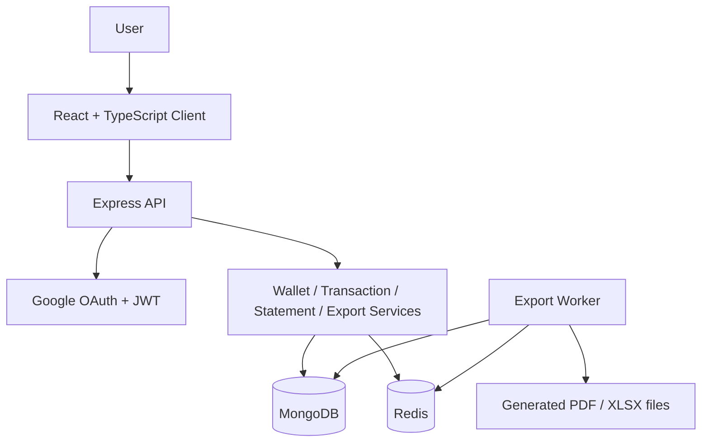

# Personal Expense Management

A personal finance web application designed to track wallet balances, record transactions, summarize cash flow, and generate financial reports over time.

## Overview

This project addresses the common problem of managing personal finances manually through spreadsheets or disconnected tools. It provides a centralized system to:

- sign in with Google
- create and manage multiple wallets
- track income and expense transactions
- automatically update balances
- review statement summaries by time period
- export reports in PDF and Excel format
- enforce user and tenant-scoped access control

The application follows a clear client-server architecture with React on the frontend, Express on the backend, MongoDB as the persistence layer, and Redis for background export processing.

## Business problem it solves

Without a proper tracking system, users often struggle with:

- poor visibility into total balances and wallet-level funds
- inconsistent transaction records
- difficult monthly or period-based reviews
- manual calculation errors and weak financial control

This project provides a structured way to manage daily personal cash flow using real transaction logic instead of a simple UI mockup.

## Core features

### 1. Authentication

- Google sign-in
- automatic user creation on first login
- JWT-based protected routes
- tenant-aware data isolation

### 2. Wallet management

- create multiple wallets for different financial sources
- store account metadata and opening balance values
- calculate total balance across all wallets

### 3. Transactions

- record income and expense entries
- select wallet, category, date, amount, and notes
- update balances automatically after each transaction
- prevent invalid spending when funds are insufficient

### 4. Statement reporting

- filter by wallet and date range
- compute opening balance, total income, total expense, and closing balance
- display the detailed transaction list for the selected period

### 5. Export pipeline

- generate report exports
- produce PDF and Excel files
- handle report generation asynchronously via worker processing
- allow file download once export is completed

## System architecture



## Project structure

```text
personal-expense-management/
├── client/                     # Frontend React + Vite
│   ├── src/
│   ├── package.json
│   └── vite.config.ts
├── server/                     # Backend Express + TypeScript
│   ├── src/
│   ├── package.json
│   └── tsconfig.json
├── docs/                       # Technical documentation
│   ├── architecture.md
│   ├── api.md
│   ├── database.md
│   ├── dev-guide.md
│   └── advanced-performance.md
├── docker-compose.yml          # Local orchestration
├── README.md                   # Project overview
├── .env.example                # Example environment settings
└── package.json                # Optional root metadata
```

## Tech stack

### Frontend

- React
- TypeScript
- Vite
- responsive UI styling

### Backend

- Node.js
- Express.js
- TypeScript
- JWT authentication
- Google OAuth verification

### Data and infrastructure

- MongoDB
- Redis
- Docker + Docker Compose
- health checks and readiness endpoints

## Documentation

The primary technical references are kept in the docs directory:

- [docs/architecture.md](docs/architecture.md) — architecture, request flows, and system boundaries
- [docs/api.md](docs/api.md) — API contract and endpoint documentation
- [docs/database.md](docs/database.md) — data model and storage design
- [docs/dev-guide.md](docs/dev-guide.md) — local workflow and troubleshooting notes
- [docs/advanced-performance.md](docs/advanced-performance.md) — scale, export, and multi-tenant design targets

## Quick start

```bash
chmod +x scripts/setup-env.sh
./scripts/setup-env.sh
```

This single script will:

- create `client/.env` and `server/.env` from the example files if they do not exist
- auto-fill safe demo defaults for a first-run local setup
- keep the app bootable even before a real Google OAuth client ID is configured
- start Docker Compose automatically from the project root

Important:

- Google sign-in will still need a real OAuth client ID if you want the login flow to work fully.
- The app will start in demo mode so the system is runnable without a deep technical setup.

Then open:

- Frontend: http://localhost:5173
- Backend: http://localhost:5000
- Health: http://localhost:5000/api/ready

## Google OAuth setup & running locally

If you want the Google sign-in flow to work for reviewers, follow these steps or run the included script which will prompt for required values.

1. Create a Google OAuth Client ID

- Open the Google Cloud Console: https://console.cloud.google.com/
- Create or select a Project.
- Configure the OAuth consent screen (External or Internal depending on your use case).
- Go to "Credentials" → "Create Credentials" → "OAuth client ID" → choose "Web application".
- Add the following Authorized JavaScript origins for local development:
    - `http://localhost:5173`
- Copy the generated **Client ID** (format: `1234567890-abcde12345.apps.googleusercontent.com`).

2. Populate `.env` (recommended: use the helper script)

Recommended: run the helper script which will prompt and validate keys, then start Docker:

```bash
chmod +x scripts/setup-env.sh
./scripts/setup-env.sh
```

Manual alternative:

```bash
cp client/.env.example client/.env
cp server/.env.example server/.env
# Edit client/.env and server/.env: set VITE_GOOGLE_CLIENT_ID, GOOGLE_CLIENT_ID, JWT_SECRET
```

3. Generate a secure `JWT_SECRET` (optional helper)

```bash
openssl rand -base64 32
```

4. Start Docker (if you didn't use the script)

```bash
docker compose up --build
```

Notes
- Do NOT commit your `.env` files; keep only `*.example` in the repo.
- `GOOGLE_CLIENT_ID` in `server/.env` must match `VITE_GOOGLE_CLIENT_ID` in `client/.env` exactly.
- For production, replace placeholders with credentialed URIs and use a secret manager.

## Running the project

### Required environment setup before Docker

This project expects the real env files to exist before startup. If they are missing, Docker will not run correctly and the app will show clear configuration errors instead of silently failing.

```bash
cp client/.env.example client/.env
cp server/.env.example server/.env
```

Then fill in the required values in those files:

- `client/.env`: `VITE_API_URL`, `VITE_GOOGLE_CLIENT_ID`
- `server/.env`: `PORT`, `MONGO_URI`, `REDIS_URL`, `JWT_SECRET`, `GOOGLE_CLIENT_ID`, `CORS_ORIGIN`

Important:

- `JWT_SECRET` must be a real secure random string.
- `GOOGLE_CLIENT_ID` in the server must match the same value used by `VITE_GOOGLE_CLIENT_ID` in the client.
- Do not commit real `.env` files. Only `.env.example` files are safe to keep in the repo.

If any required value is still left as a placeholder such as `replace_with_...` or `your-google-client-id-here`, the application will fail fast with a clear startup message telling you exactly which variable must be updated.

### With Docker

```bash
docker compose up --build
```

Access points after startup:

- Frontend: http://localhost:5173
- Backend: http://localhost:5000
- Health check: http://localhost:5000/api/ready

### Local development

Terminal 1:

```bash
cd client
npm install
npm run dev
```

Terminal 2:

```bash
cd server
npm install
npm run dev
```

### Environment variables

If needed, copy the example environment files:

```bash
cp client/.env.example client/.env
cp server/.env.example server/.env
```

Common variables include:

- `JWT_SECRET`
- `GOOGLE_CLIENT_ID`
- `MONGO_URI`
- `REDIS_URL`
- `CORS_ORIGIN`
- `VITE_API_URL`

## Validation

The project includes automated checks for core logic such as:

- wallet balance validation
- statement calculations
- PDF and Excel export generation
- queue behavior
- health status logic

Run the test suite with:

```bash
cd server
npm test
```

## Advanced design goals

This application is designed beyond a basic CRUD demo. The key scale goals are:

- support one user with 100 bank accounts and millions of transactions
- generate PDF and Excel reports for very large datasets
- design a multi-tenant architecture capable of handling millions of requests per minute

The detailed design note for these targets is available in [docs/advanced-performance.md](docs/advanced-performance.md).

## Conclusion

Personal Expense Management is a full-stack financial application built around realistic personal money management use cases. It combines authentication, wallet accounting, transaction tracking, statement summaries, and export processing into a cohesive and deployable platform.

The repository is structured to make the product understandable at a glance while keeping deeper engineering details in the documentation folder for readers who want more technical depth.
