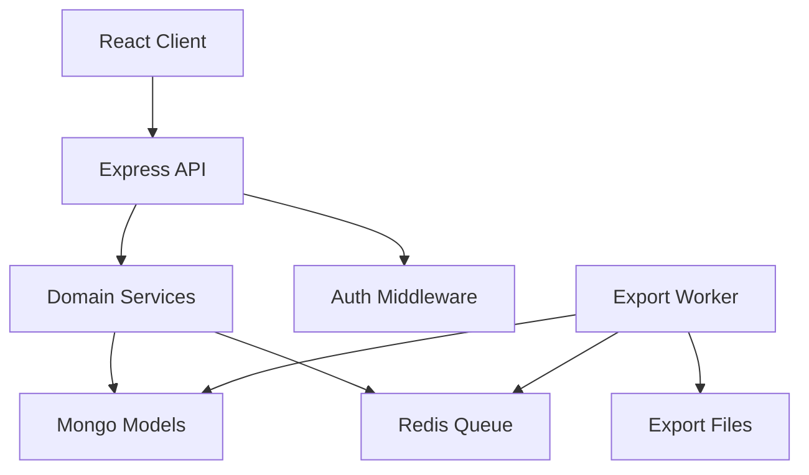

# Architecture Document

## Overview
This project is a personal finance application with a React frontend, an Express API, MongoDB persistence, and Redis-backed export queue processing.

## Layered architecture

## Request flow
### Auth flow
1. User signs in with Google on the frontend.
2. Server verifies Google token and creates or finds the user.
3. Server creates or binds a tenant.
4. Server issues a JWT containing `id`, `email`, `tenantId`, and `role`.
5. Protected routes validate the JWT and tenant context.

### Transaction flow
1. Client sends transaction payload to `/api/transactions`.
2. Route validates input.
3. Service recalculates wallet balance and persists transaction.
4. Wallet balance is updated atomically within the transaction session.
5. Response returns the created transaction.

### Statement/export flow
1. Client requests report export from the statement screen.
2. Server creates an export job record.
3. Export generation is processed by worker or direct generation fallback for reliability.
4. PDF/XLSX file is written to the export folder.
5. Client polls the job status and downloads the file when completed.

## Module map
### Client
- `src/pages`: page-level screens such as Login, Dashboard, Transactions, Wallets, Statement
- `src/components`: reusable UI elements and layout controls
- `src/api`: API client and request shaping
- `src/contexts`: application context providers
- `src/assets`: static assets

### Server
- `src/routes`: HTTP handlers and route registration
- `src/services`: business logic, pagination helpers, queue, export generation
- `src/models`: Mongoose schemas
- `src/middleware`: auth and shared request utilities
- `src/validators`: payload validation
- `src/worker.ts`: queue consumer for export jobs

## Security model
- Tenant isolation is enforced via `tenantId` on wallets, transactions, and export jobs.
- JWT validation is required for protected routes.
- Read/write permissions are enforced per role.
- Google OAuth is used as the external login provider.

## Database design
Core collections:
- `users`
- `tenants`
- `wallets`
- `transactions`
- `exportjobs`

Important indexes are placed on tenant + user + date fields to support financial reporting and tenant scoping.

## Operational notes
- Redis is used for export job queueing and fallback processing.
- MongoDB stores transactional records and tenant-scoped data.
- Export files are stored on disk under the server export directory.
- Docker Compose is used for local environment orchestration.

## Risks and trade-offs
- Worker queue reliability can be a runtime bottleneck if Redis is unavailable.
- `console.log` is acceptable in development but should be standardized for production logging.
- Current Export route and worker both perform large generation logic; a shared service layer would reduce divergence over time.
