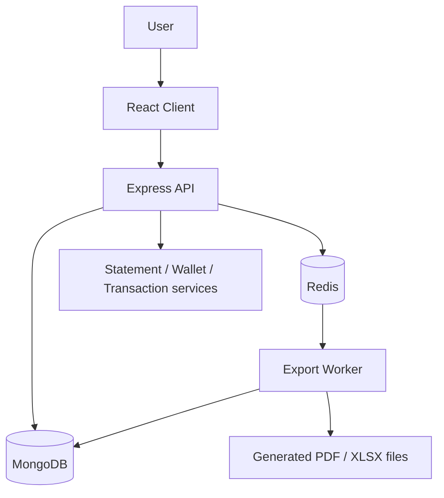

# Architecture

## 1. Executive summary

The Personal Expense Management application is a wallet-based personal finance system with a React frontend, an Express + TypeScript backend, MongoDB persistence, and Redis-backed background jobs for export processing.

The system is designed around one core principle: financial state must remain consistent and auditable. Wallet balance is not treated as a simple UI display value; it is derived from transaction effects and verified against the canonical transaction ordering.

At a high level:

- the client handles user interaction and presentation
- the API enforces auth, tenant isolation, validation, and business rules
- MongoDB stores wallets, transactions, snapshots, jobs, and user metadata
- Redis handles async work for export and background validation
- worker processes generate report files without blocking the main API path

## 2. System overview

### 2.1 Primary responsibilities

- Client: dashboard, wallet management, statement viewing, export triggers
- API: validation, auth, transaction mutation, query endpoints, export job creation
- Services: wallet logic, transaction effects, statement calculation, export orchestration
- Storage: MongoDB documents and file persistence for generated reports
- Background workers: export generation, snapshot checks, job lifecycle processing

## 3. Domain model

### 3.1 User and tenant

The application is tenant-aware, even though the current implementation is largely single-tenant in usage.

- User: authenticated identity, email, Google profile, tenant linkage
- Tenant: logical workspace owner for data isolation

This separation allows future multi-tenant expansion without rewriting the storage model.

### 3.2 Wallet

A wallet represents a financial account or source of funds.

Core fields:

- tenantId
- userId
- name
- initialBalance
- currentBalance
- version
- initialBalanceDate

Wallet balance is treated as:

- opening account value + sum of transaction effects

The system ensures transactions are applied consistently and that wallet balance does not become negative unless the business rule explicitly allows it.

### 3.3 Transaction

A transaction represents a movement of money for a wallet.

Core fields:

- tenantId
- walletId
- userId
- amount
- type: INCOME or EXPENSE
- date
- note
- category
- createdAt / updatedAt

Transaction effect is computed by type:

- INCOME => +amount
- EXPENSE => -amount

The application treats transactions as the source of truth for financial state.

### 3.4 Balance snapshot

Balance snapshots are used as checkpoints to optimize statement and balance computations.

A valid snapshot stores:

- walletId
- tenantId
- snapshotAt
- balance
- lastTransactionDate
- lastTransactionCreatedAt
- lastTransactionId
- status

Snapshots are performance optimization artifacts, not the source of truth. If a snapshot is stale or invalid, the system must fall back to recomputation.

### 3.5 Export job

Export jobs are async tasks used to generate a downloadable statement or report.

Fields include:

- walletId
- tenantId
- userId
- fromDate
- toDate
- format: PDF or XLSX
- status
- fileKey
- pages
- totalPages
- error

The export flow is intentionally asynchronous so large report generation does not block user requests.

## 4. Core business rules

### 4.1 Canonical ordering

Financial calculations are based on the canonical ordering:

- date ascending
- createdAt ascending
- _id ascending

This ordering is used for:

- statement sorting
- snapshot checkpointing
- running balance computation
- ensuring deterministic behavior when several transactions share the same date

### 4.2 Half-open date range

The system uses half-open filtering semantics:

- fromDate inclusive
- toDate exclusive

This is implemented as:

- date >= fromDate
- date < toDate

This is important because it prevents boundary items from appearing in both adjacent reports.

### 4.3 Balance invariants

The wallet balance is expected to satisfy the invariant:

- currentBalance = initialBalance + sum(transactionEffect)

For each transaction change:

- income increases balance
- expense decreases balance
- note-only or date-only edits must not alter the current wallet balance
- type change from income to expense or expense to income must change the effect by the delta implied by the old and new effect

## 5. Request flow

### 5.1 Authentication flow

1. Frontend obtains Google ID token from Google OAuth
2. Backend verifies the token with Google
3. Backend creates or resolves a User and Tenant
4. Backend signs a JWT containing user and tenant identity
5. Protected routes require Authorization: Bearer <token>

### 5.2 Transaction creation flow

1. Request arrives with walletId, amount, type, date, note
2. API validates input
3. Server checks wallet ownership and access
4. Server computes old effect and new effect
5. Delta is applied to wallet currentBalance
6. Transaction is created
7. Snapshot invalidation or refresh logic is triggered if necessary
8. Response returns created transaction and updated wallet metadata

### 5.3 Transaction edit flow

1. Existing transaction is loaded
2. Old effect is compared with new effect
3. Balance delta is calculated
4. Wallet is adjusted according to delta
5. Snapshot and associated derived state are invalidated if affected
6. Response returns updated transaction snapshot and wallet state

### 5.4 Statement flow

1. API receives walletId, fromDate, toDate
2. It resolves opening balance before fromDate
3. It fetches transactions in the range
4. It computes running balances in chronological order
5. It returns:
   - openingBalance
   - transactions
   - totalIncome
   - totalExpense
   - finalRunningBalance or equivalent closing state

## 6. Statement and snapshot architecture

The statement system is designed to work without requiring expensive full recomputation for every request.

### 6.1 Direct recomputation path

If there is no usable snapshot or the snapshot is stale, the service recomputes from wallet initialBalance and transactions before the query range.

### 6.2 Snapshot optimization path

Balance snapshots store a consistent checkpoint for a wallet at a given transaction boundary.

This allows the system to:

- avoid scanning the entire wallet history repeatedly
- jump to the last valid checkpoint
- apply only the delta after that checkpoint

### 6.3 Important rule

Snapshots are optimization data. They do not replace correctness rules.

If a snapshot is stale or invalid, the system must fall back to recomputation or to a valid checkpoint before the query range.

## 7. Export architecture

### 7.1 Export job lifecycle

1. User requests export via API
2. API validates wallet and date range
3. ExportJob is created with status PENDING
4. Export is queued to Redis
5. Worker picks up the job
6. Worker loads wallet + transaction data for the range
7. Worker computes opening balance, total income, total expense, ending balance
8. Worker streams data into PDF/XLSX format
9. Worker saves file to storage and updates job as COMPLETED

### 7.2 Why export is asynchronous

Large exports can take much longer than a normal HTTP request. The asynchronous model isolates long-running generation from the main API request thread and keeps the user experience responsive.

### 7.3 Bounded-memory export requirements

For large datasets, the export flow must obey the following constraints:

- stream data instead of building all rows in an array
- process transactions via cursor or chunked iteration
- store temporary chunk files on disk, not in memory
- merge PDF chunks only at the end
- keep consistent preflight and final summary values

This avoids runaway memory growth while preserving output correctness.

## 8. Persistence and data flow

### 8.1 MongoDB

MongoDB is the system of record for:

- users
- tenants
- wallets
- transactions
- balance snapshots
- export jobs

It is designed to support both transactional updates and efficient range queries.

### 8.2 Redis

Redis is used for work coordination, not as the source of truth.

It supports:

- export job queue
- worker polling
- stale job recovery
- dead-letter handling for jobs that fail repeatedly

### 8.3 Filesystem / storage adapter

Generated report files are persisted to storage via a storage adapter abstraction.

This keeps the worker logic independent from the concrete storage backend and allows a local filesytem implementation or object storage implementation to be plugged in later.

## 9. Safety and correctness constraints

The application is designed around correctness first, performance second.

### 9.1 Validation

Inputs such as amount and type must be validated before mutation. Examples include:

- amount > 0
- type in { INCOME, EXPENSE }
- required wallet and date fields
- wallet ownership and tenant access checks

### 9.2 Insufficient balance rule

The system checks whether a proposed modification would push wallet balance below zero. If so, the operation is rejected or flagged as a business conflict.

This check is based on the resulting wallet state after the delta, not by recreating all historical transactions at a point in time.

### 9.3 Snapshot invalidation

When transactions are created, edited, or deleted, the system invalidates or refreshes affected snapshots so that statement and balance calculations stay consistent.

## 10. Operational notes

### 10.1 Indexing

Critical indexes are expected for transaction-heavy workloads:

- tenantId + walletId + date + createdAt + _id

This supports both ordered query semantics and efficient range scanning.

### 10.2 Worker execution

The worker is separated from the API runtime to prevent long-running jobs from blocking normal requests. This keeps the application resilient under heavy export workloads.

### 10.3 Observability

Production-grade export processing should include:

- job start and completion logs
- chunk / page count logs
- preflight summary logs
- peak memory monitoring
- failure reasons and dead-letter handling

## 11. Conclusion

The architecture is built around a simple but important principle: the wallet balance must be consistent with transaction history, and export generation must not undermine that guarantee.

The design combines:

- authenticated and tenant-scoped API access
- transaction-first financial logic
- snapshot optimization for performance
- background export processing for large reports
- disciplined correctness checks around range logic, totals, and page accounting

This makes the system suitable for personal expense tracking while remaining scalable enough to support heavier reporting and export workloads.
