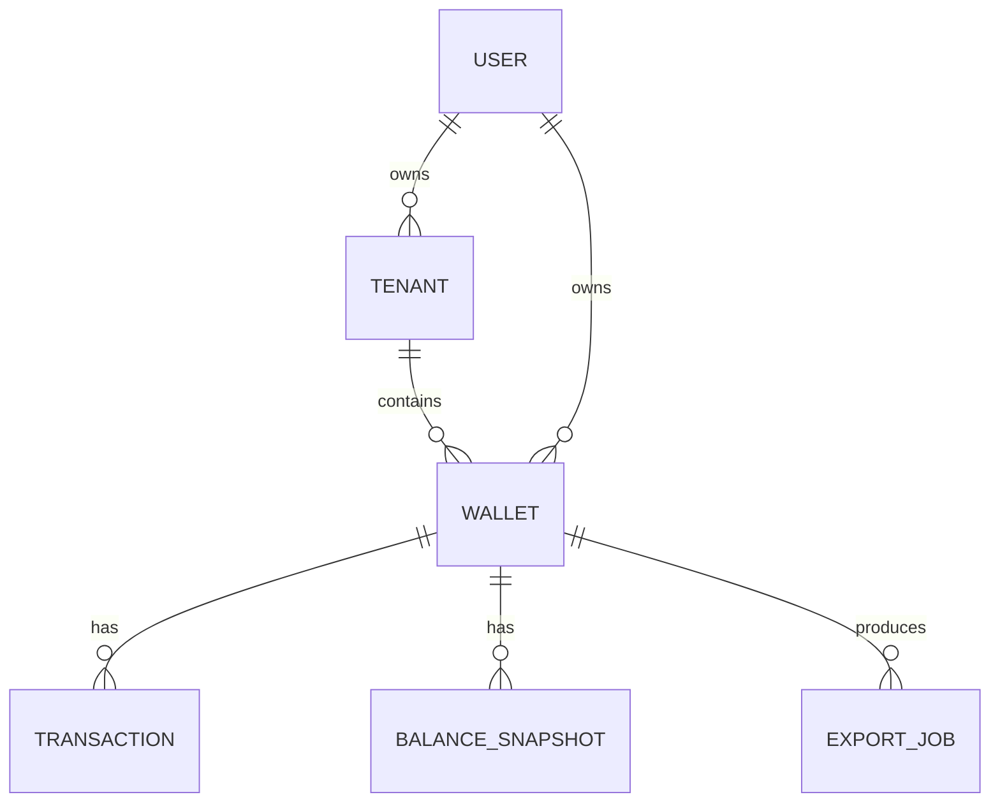

# Database design

## 1. Overview

The application uses MongoDB as the primary datastore. The database model is shaped around personal finance operations: wallets, transactions, snapshots, and export jobs.

The design emphasizes:

- transactional correctness for wallet balance updates
- efficient ranges for statement data
- deterministic ordering for financial computations
- support for background export processing

---

## 2. Collections

### 2.1 users

Stores authenticated users.

Common fields:

```ts
{
  _id: ObjectId,
  googleId: String,
  email: String,
  name: String,
  avatar: String?,
  tenantId: ObjectId?,
  createdAt: Date,
  updatedAt: Date
}
```

Indexes:

- unique on `googleId`
- unique on `email`
- index on `tenantId`

Purpose:

- identify authenticated account
- support tenant-scoped access
- allow a single person to belong to one default workspace

### 2.2 tenants

Stores logical workspaces or groups.

Common fields:

```ts
{
  _id: ObjectId,
  name: String,
  slug: String,
  status: "ACTIVE" | "INACTIVE",
  ownerId: ObjectId,
  createdAt: Date,
  updatedAt: Date
}
```

Indexes:

- unique on `slug`
- index on `status`, `createdAt`

Purpose:

- separate user data by workspace
- prepare for multi-tenant expansion

### 2.3 wallets

Represents a financial account or wallet.

Common fields:

```ts
{
  _id: ObjectId,
  tenantId: ObjectId,
  userId: ObjectId,
  name: String,
  initialBalance: Decimal128,
  currentBalance: Decimal128,
  version: Number,
  initialBalanceDate: Date,
  createdAt: Date,
  updatedAt: Date
}
```

Indexes:

- index on `tenantId`, `userId`
- index on `userId`

Purpose:

- store ledger state for a wallet
- keep opening balance and current balance as financial primitives

### 2.4 transactions

Represents every movement of money in a wallet.

Common fields:

```ts
{
  _id: ObjectId,
  tenantId: ObjectId,
  userId: ObjectId,
  walletId: ObjectId,
  amount: Decimal128,
  type: "INCOME" | "EXPENSE",
  category: ObjectId | String,
  note: String,
  date: Date,
  createdAt: Date,
  updatedAt: Date
}
```

Indexes:

- index on `tenantId`, `walletId`, `date`, `createdAt`, `_id`
- index on `walletId`, `date`
- index on `tenantId`, `walletId`

Purpose:

- support quick range queries
- support running-balance calculation
- support statement generation and export

### 2.5 balance_snapshots

Stores snapshot checkpoints for faster statement and balance recalculation.

Common fields:

```ts
{
  _id: ObjectId,
  tenantId: ObjectId,
  walletId: ObjectId,
  snapshotAt: Date,
  balance: Decimal128,
  lastTransactionDate: Date,
  lastTransactionCreatedAt: Date,
  lastTransactionId: ObjectId,
  status: "VALID" | "INVALID",
  createdAt: Date,
  updatedAt: Date
}
```

Indexes:

- index on `walletId`, `status`
- index on `tenantId`, `walletId`, `lastTransactionDate`

Purpose:

- checkpoint wallet state at a known transaction boundary
- shorten statement recomputation for large wallets
- provide a fallback correctness mechanism if stale snapshot is detected

### 2.6 export_jobs

Stores queued report jobs and export metadata.

Common fields:

```ts
{
  _id: ObjectId,
  tenantId: ObjectId,
  userId: ObjectId,
  walletId: ObjectId,
  fromDate: Date,
  toDate: Date,
  format: "PDF" | "XLSX",
  status: "PENDING" | "IN_PROGRESS" | "COMPLETED" | "FAILED" | "EXPIRED",
  fileKey: String,
  pages: Number,
  totalPages: Number,
  error: String,
  createdAt: Date,
  updatedAt: Date
}
```

Indexes:

- index on `tenantId`, `userId`, `status`
- index on `status`, `createdAt`

Purpose:

- track export lifecycle
- support polling and download endpoints
- support failure debugging and auditability

---

## 3. Data model relationships



### Relationship rules

- each user belongs to a tenant
- each wallet belongs to a tenant and a user
- each transaction belongs to a wallet and tenant
- balance snapshots are wallet-specific checkpoints
- export jobs reference a wallet and optionally a tenant/user

---

## 4. Financial correctness model

### 4.1 Canonical ordering

The system uses the canonical ordering tuple when performing calculations and statement generation:

```text
(date, createdAt, _id)
```

This matters because multiple transactions can share the same date, and the ordering must be deterministic to avoid inconsistent running balances.

### 4.2 Range semantics

The statement and export logic should use half-open range semantics:

```text
fromDate <= transaction.date < toDate
```

This is important because it prevents a transaction on the end boundary from being counted in both adjacent periods.

### 4.3 Balance derivation

The wallet balance is derived from:

```text
initialBalance + sum(transaction effects)
```

Where:

- INCOME: +amount
- EXPENSE: -amount

This makes the database model an auditable ledger rather than just a set of UI state values.

---

## 5. Snapshot semantics

Balance snapshots are designed to improve performance but not to replace data correctness.

A valid snapshot stores the wallet balance at a known transaction checkpoint.

Example:

```text
wallet initialBalance = 1000
snapshot at transaction T10 with balance 1350
range export begins after T10
system can compute from 1350 + subsequent deltas
```

Important rule:

- snapshot is optimization data
- transaction history remains the truth source
- if snapshot is stale or invalid, recomputation must be used

---

## 6. Decimal handling

Money values should use precise decimal semantics instead of binary floating point.

The project uses Decimal128 or Decimal-based conversions to avoid:

- rounding drift
- incorrect totals across large ranges
- incorrect balance deltas after repeated edits

This is critical for statements and export totals.

---

## 7. Indexing strategy

For common financial queries, the following indexing approach is important:

```text
{ tenantId: 1, walletId: 1, date: 1, createdAt: 1, _id: 1 }
```

This index supports:

- range queries by wallet and time window
- deterministic ordering
- efficient statement generation
- efficient export filtering

---

## 8. Mutation and invalidation

When a transaction is created, updated, or removed:

- wallet balance may change
- affected snapshots may become stale
- statement calculations may need recomputation

The invalidation logic should mark snapshots as invalid or trigger a refresh based on the affected transaction boundary.

This ensures that all expensive derived state is rebuilt when needed.

---

## 9. Operational concerns

### 9.1 Write contention

Large numbers of transaction edits on the same wallet can lead to write contention. The application can mitigate this with:

- optimistic locking on wallet version
- transaction-safe balance updates when supported by the MongoDB deployment
- queue-based throttling for heavy write scenarios

### 9.2 Data safety

A financial system must avoid silent drift. The database model should always support the ability to:

- recalculate balance from transactions
- verify snapshot correctness
- regenerate exported reports from source data

---

## 10. Summary

The database design centers on a simple but strict rule: wallet balance must always be representable as the sum of initial balance plus transaction effects, and reports must be calculated from the same transaction set, in the same canonical order.

The design supports:

- correct transaction accounting
- efficient statement calculation
- scalable export generation
- future tenant-aware extension

This is the foundation that all API and export logic should respect.
