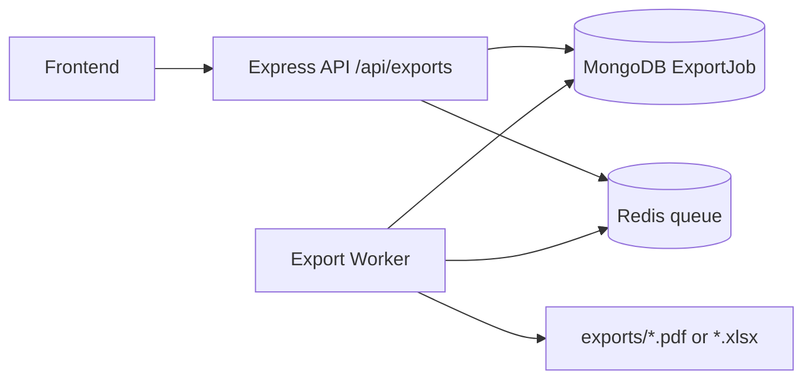
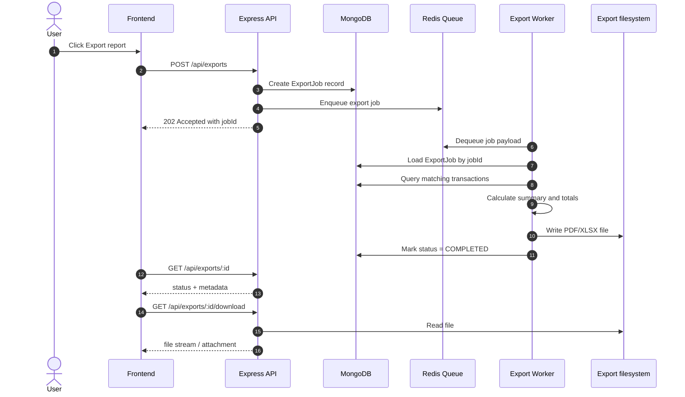

# Export functionality

## Overview

The export feature allows users to generate a transaction report for a selected time range and optionally a specific wallet. This document describes the real runtime flow from the frontend to the backend, worker processing, and debugging steps when export jobs remain stuck or fail to generate files.

The system currently supports two formats:

- PDF
- XLSX

Exported files are stored in the `exports` directory under the server project and are returned to the client through the download endpoint once the job finishes.

---

## End-to-end flow

### 1. User triggers an export

From the Statement / Reports screen, the user selects:

- start and end date
- wallet (optional)
- export format (PDF or XLSX)

Then the frontend calls:

```http
POST /api/exports
```

Example request body:

```json
{
  "walletId": "64d9d41b1f4b2d17a5d471a1",
  "startDate": "2026-08-01",
  "endDate": "2026-08-31",
  "format": "pdf"
}
```

If `walletId` is omitted, the export includes all wallets for the current tenant and user.

### 2. Server creates the job

The backend creates an `ExportJob` document in MongoDB with the following key fields:

- `tenantId`
- `userId`
- `format`
- `filters.walletId`
- `filters.startDate`
- `filters.endDate`
- `status`
- `expiresAt`

As soon as the job is created, the API returns HTTP `202 Accepted` with a `jobId` and initial status:

```json
{
  "jobId": "64d9d...",
  "status": "PENDING",
  "format": "pdf",
  "expiresAt": "2026-08-24T12:00:00.000Z"
}
```

---

## Queue and worker

The export is not processed synchronously at request time. Instead, the system uses a Redis queue to place the work item in a waiting line, and a dedicated worker consumes that job and creates the file.

### Queue architecture



### Job lifecycle

An export job moves through the following states:

- `PENDING`: job created but not started yet
- `PROCESSING`: worker is handling the export
- `COMPLETED`: file has been generated successfully
- `FAILED`: processing failed and the job cannot be retried further
- `EXPIRED`: job expired before completion

The relevant processing logic is implemented in:

- `server/src/routes/export.ts`
- `server/src/worker.ts`
- `server/src/services/exportProcessorService.ts`
- `server/src/services/redisQueue.ts`

---

## Worker processing flow

When the worker receives a job from Redis, it will:

1. Find the job by `jobId` in MongoDB
2. Set status to `PROCESSING`
3. Build a data filter using `tenantId`, `userId`, `walletId`, `startDate`, `endDate`
4. Query transactions in the selected period
5. Calculate summary values including:
   - total income
   - total expense
   - opening balance
   - closing balance
6. Generate the PDF or XLSX file
7. Write it to `exports/<jobId>.<format>`
8. Update `ExportJob.status = COMPLETED`
9. Set `completedAt` and `fileKey`

The generated output is stored on disk rather than in MongoDB, which makes download handling simpler and faster.

### Sequence diagram



---

## Status and download endpoints

### GET /api/exports/:id

Use this endpoint to poll the job status.

Example:

```bash
curl -H "Authorization: Bearer <token>" \
  http://localhost:5000/api/exports/64d9d41b1f4b2d17a5d471a1
```

Example response:

```json
{
  "_id": "64d9d41b1f4b2d17a5d471a1",
  "tenantId": "64d9d3f9b1f4b2d17a5d470d1",
  "userId": "64d9d3f9b1f4b2d17a5d470d2",
  "format": "pdf",
  "status": "COMPLETED",
  "filters": {
    "startDate": "2026-08-01",
    "endDate": "2026-08-31"
  },
  "expiresAt": "2026-08-25T12:00:00.000Z"
}
```

### GET /api/exports/:id/download

Use this endpoint to download the generated file when the job is in `COMPLETED` state.

```bash
curl -L -H "Authorization: Bearer <token>" \
  http://localhost:5000/api/exports/64d9d41b1f4b2d17a5d471a1/download \
  -o report.pdf
```

If the job is not ready yet, the API returns `409 Conflict` with the message `Export is not ready yet`.

---

## Important environment variables

The server configuration lives in `server/.env` or `server/src/config.ts`.

The export-related variables are:

- `MONGO_URI`: MongoDB connection string
- `REDIS_URL`: Redis connection string
- `EXPORT_DIR`: export file directory (default: `exports`)
- `WORKER_MODE`: `api` or `worker`
- `ENABLE_EXPORT_WORKER`: `true/false`
- `RENDER`: used to auto-start the worker on Render

### Worker startup rules

In `server/src/config.ts`, the application decides whether to launch the export worker according to this order:

1. `ENABLE_EXPORT_WORKER=true` => start worker
2. `ENABLE_EXPORT_WORKER=false` => disable worker
3. `WORKER_MODE=worker` => start worker
4. `WORKER_MODE=api` => disable worker
5. Default: when running on `RENDER` or with `NODE_ENV=production`, the worker is automatically started

This is critical because if the backend API runs without a live worker, the export job can remain stuck in `PENDING` indefinitely.

---

## Troubleshooting

### 1. Job remains stuck in PENDING

Common causes:

- worker is not running
- Redis is not reachable
- queue payload was never enqueued
- app is running in `api` mode while export requires a worker

Quick checks:

```bash
docker compose ps

docker compose logs -f worker
```

If the worker does not emit any export-related logs, check `WORKER_MODE` and Redis connectivity.

### 2. Export file is not generated

Common causes:

- the `exports` directory is not writable
- the job shows `COMPLETED` but the file was deleted or saved to the wrong path
- a runtime error occurred while creating the export

Check:

```bash
ls -la ./server/exports
```

Then inspect the worker logs for the actual error.

### 3. Redis or MongoDB is unavailable

If Redis or MongoDB is down, the job can be created but the worker will fail when pulling the queue item or writing the file.

Check readiness:

```bash
curl http://localhost:5000/api/ready
```

### 4. Single-node MongoDB compatibility issue

When using a single-node MongoDB instance, avoid transaction-session flows that require a replica set. For export, the main logic is reading job documents and generating files; it does not require replica-set-only behavior. However, other parts of the app can still be affected if they rely on replica-set-only transaction patterns.

---

## Quick local debugging

### Start the stack

```bash
docker compose up --build
```

### Check health

```bash
curl http://localhost:5000/api/ready
```

### Create an export job

```bash
curl -X POST http://localhost:5000/api/exports \
  -H "Authorization: Bearer <token>" \
  -H "Content-Type: application/json" \
  -d '{
    "walletId": "<walletId>",
    "startDate": "2026-08-01",
    "endDate": "2026-08-31",
    "format": "pdf"
  }'
```

### Poll status

```bash
curl -H "Authorization: Bearer <token>" \
  http://localhost:5000/api/exports/<jobId>
```

### Download the file

```bash
curl -L -H "Authorization: Bearer <token>" \
  http://localhost:5000/api/exports/<jobId>/download \
  -o statement.pdf
```

---

## Architecture notes

The export feature is currently implemented as a lightweight background pipeline:

- the API is responsible for receiving requests and creating jobs
- Redis handles queueing
- the worker is responsible for processing data and generating files
- MongoDB stores job state
- files on disk are used for fast download and verification

This model is a good fit because export operations can take time and should not block the main HTTP request path.

---

## Future improvement ideas

The following improvements are worth considering:

- add retry/backoff behavior for queue operations when the worker is temporarily offline
- standardize logger and metrics for export jobs
- move files to cloud storage instead of the local filesystem
- support bulk export across multiple wallets or report types
- add caching and compression for large generated files
